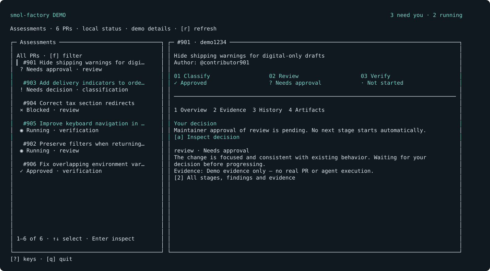

# smol-factory

```text
                         ┌──┐   ┌──┐
                         │  │   │  │
                 ┌───────┘  └───┘  └─┐
                 │      s m o l      │
                 │   f a c t o r y   │
                 └───────────────────┘
```

An agent-led issue and PR assessment framework with a terminal view and explicit maintainer decisions.



---

Every repository has its own idea of a useful contribution. smol-factory lets you
write that down and have agents classify, review, and verify incoming PRs, with
your approval between stages.

Install the package from GitHub with [Bun](https://bun.sh)
(see [prerequisites](#run) below):

```sh
bun install -g github:peelar/smol-factory
```

Then start in the repository you maintain:

```sh
cd /path/to/your-repo
smol
```

Install the skill from the onboarding screen, then open your coding agent in the
same repository and ask:

```text
Use the smol-factory skill to set up this repository.
```

The agent inspects committed source and recent PR history, drafts repository
context and assessment rules, and checks the configuration. Those rules live in
`.smol-factory/` as editable Markdown and JSON.

Then ask your agent to scan and classify incoming PRs:

```text
Scan open PRs and classify them using this repository's smol-factory policy.
```

Open `smol` to read the findings and decide what moves forward. Classification
checks product fit, review inspects code, and verification runs the approved
checks. Each stage keeps its evidence locally and waits for a maintainer decision.

## Features

- A keyboard-first terminal UI that pages through open issues and PRs and shows local workflow progress beside each item.
- Repository-specific classification, review, and verification rules in Markdown.
- Explicit maintainer approval between stages, tied to the assessed revision and policy.
- Revision checks that invalidate stale assessments when a PR or its policy changes.
- Local reports, approval history, and retained workspaces for following up on findings.
- A CLI for agent harnesses, with the same assessment state used by the terminal UI.
- A bundled Codex adapter with per-stage model settings and concurrency limits.
- Agent-led issue/PR scans, exact action proposals, and explicitly approved GitHub writes. No automatic merges or contributor code repairs.

> [!NOTE]
> smol-factory is an early local tool. The bundled agent adapter uses Codex and
> GitHub is the PR source. Contributor code runs only during approved verification.

## Run

Install [Bun](https://bun.sh), [Git](https://git-scm.com), and the
[GitHub CLI](https://cli.github.com). Authenticate `gh` for the repositories you
want to assess. The bundled adapter also needs an installed, authenticated Codex CLI.
The development Bun version is pinned in [.bun-version](.bun-version).

Install directly from GitHub:

```sh
bun install -g github:peelar/smol-factory
```

Run `smol` inside the repository you want to assess. If your shell cannot find it,
add Bun's global bin directory (`bun pm bin -g`) to your `PATH`.

Onboarding installs the repository skill. To also make it available globally:

```sh
smol skill install --global
```

Use a coding agent that discovers `.agents/skills`; refresh its skill discovery or
start a new session after installation.

See the [usage guide](docs/usage.md) for CLI commands and development checks,
[configuration](configuration.md) for runtime settings, and the
[assessment contract](assessment-contract.md) for structured results.

[MIT license](LICENSE)

See [agent-led scans and approved GitHub actions](docs/issue-workflow.md) for repository scan skills and proposal approvals.
